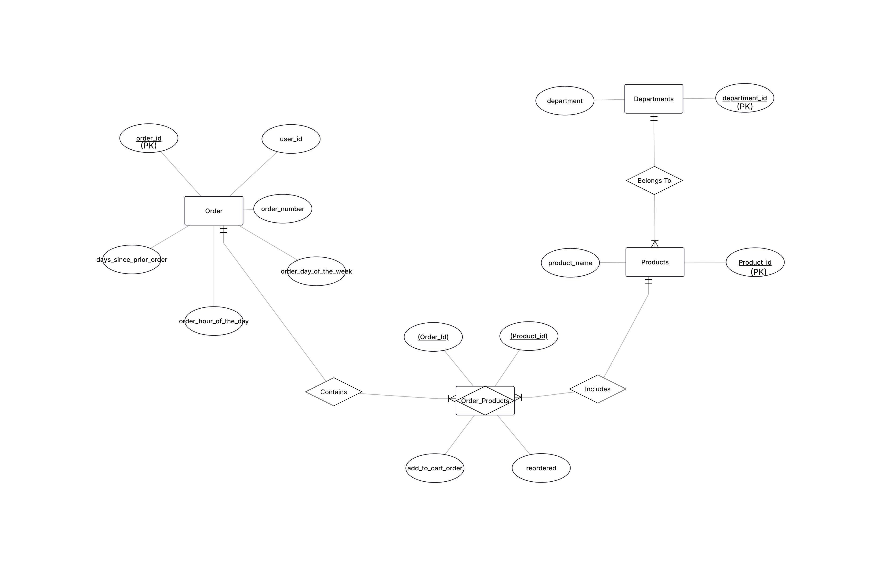

# Instacart Basket Analysis

**Which products and departments show strong, repeatable demand patterns that should guide smarter restocking?**

This project analyzes 3.4 million grocery orders from Instacart to uncover demand patterns that inform smarter inventory restocking decisions. The analysis spans SQL querying, data transformation, and interactive web visualization.

> **Live Dashboard:** [View Interactive Dashboard](https://5u2ny.github.io/instacart-basket-analysis/) — *replace 5u2ny with your GitHub username after deploying*

---

## Dashboard Preview



---

## Project Overview

### The Business Problem

Grocery retailers lose revenue from two failure modes: stockouts on high-demand staples that drive customers to competitors, and overstocking on slow-moving items that expire on shelves. This analysis identifies which products and departments have the most predictable, repeatable demand, so restocking can shift from reactive to data-driven.

### Key Findings

- **Dairy & Produce dominate reorders** — dairy eggs (66.9%) and produce (65.2%) have the highest department-level reorder rates, making them the top candidates for automated restocking triggers.

- **Organic products are loyalty magnets** — organic bananas, whole milk, and avocados show 75-84% reorder rates, far above the 59% overall average. These high-margin items should never go out of stock.

- **Weekly shoppers are the core** — 53.4% of orders happen within 7 days of the prior order. A secondary spike at 30 days captures monthly bulk buyers. Restock planning should sync to these two rhythms.

- **Weekends drive peak demand** — Saturday has ~60% more volume than midweek. Sunday shows the highest reorder rate (60.6%). Restocking should complete by Friday evening.

- **Morning shoppers are the most predictable** — early morning orders (5-9 AM) have 63-65% reorder rates, meaning these customers buy known staples. Evening shoppers explore more (55-57%).

---

## Tech Stack

| Layer | Tool | Purpose |
|-------|------|---------|
| Database | MySQL | Data storage and querying |
| Analysis | SQL | 8 analytical queries with JOINs, subqueries, CASE, GROUP BY, HAVING |
| Visualization | Tableau Desktop | Interactive 5-chart dashboard |
| Web Dashboard | HTML + Chart.js | Live hosted dashboard (GitHub Pages) |
| Data | Instacart Open Dataset | 3.4M orders across 50K products |

---

## Repository Structure

```
instacart-basket-analysis/
├── index.html                           # Live web dashboard (GitHub Pages)
├── README.md
├── sql/
│   └── instacart_analysis.sql          # Full SQL script (setup + 8 queries)
├── data/
│   ├── departments.csv                  # 21 department categories
│   └── tableau_exports/                 # Query result CSVs for Tableau
│       ├── q1_department_reorder_rates.csv
│       ├── q2_organic_products.csv
│       ├── q5_priority_restock.csv
│       ├── q6_weekly_demand.csv
│       ├── q7_reorder_frequency.csv
│       └── q8_hourly_reorder.csv
├── tableau/
│   └── Instacart_Restocking_Dashboard.twb
├── docs/
│   └── instacart_erd.png               # Entity Relationship Diagram
└── .gitignore
```

---

## Entity Relationship Diagram

The analysis joins four tables following this ERD:

```
┌─────────────┐       ┌──────────────────┐       ┌─────────────┐       ┌──────────────┐
│   Orders    │       │  Order_Products   │       │  Products   │       │ Departments  │
├─────────────┤       ├──────────────────┤       ├─────────────┤       ├──────────────┤
│ order_id ●──┼──────►│ order_id          │       │ product_id ●┼──────►│department_id │
│ user_id     │       │ product_id ●──────┼──────►│ product_name│       │ department   │
│ order_number│       │ add_to_cart_order │       │ aisle_id    │       └──────────────┘
│ order_dow   │       │ reordered         │       │department_id│
│ order_hour  │       └──────────────────┘       └─────────────┘
│ days_since  │
└─────────────┘
```

---

## SQL Queries

The analysis includes 8 progressive SQL queries, each building in complexity:

| # | Query | SQL Concepts | Business Insight |
|---|-------|-------------|-----------------|
| 1 | High-Loyalty Departments | GROUP BY, HAVING, JOIN | Identifies departments with >55% reorder rate |
| 2 | Organic Product Demand | LIKE, GROUP BY, HAVING | Finds organic products with highest repeat purchases |
| 3 | Above-Average Products | Subquery (derived table) | Products exceeding average order volume |
| 4 | Top Product per Department | Correlated subquery | The #1 seller in each department |
| 5 | Priority Restock List | Subquery + HAVING | High volume AND high reorder rate products |
| 6 | Weekly Demand Cycles | CASE, GROUP BY, Subquery | Day-of-week ordering patterns |
| 7 | Reorder Frequency Buckets | CASE, Subquery | Customer purchase frequency distribution |
| 8 | Peak Hour Analysis | GROUP BY, HAVING, CASE | Hourly reorder rate patterns |

---

## Dashboard Components

The Tableau dashboard contains 5 interconnected visualizations:

1. **Reorder Frequency** (Pie Chart) — Distribution of customer reorder cycles: weekly, bi-weekly, tri-weekly, and monthly patterns.

2. **Priority Restock: Volume vs Reorder Rate** (Scatter Plot) — Maps products by total orders against reorder rate to identify restocking VIPs that combine high demand with high loyalty.

3. **Hourly Reorder Rate by Time Period** (Line Chart) — Reveals how reorder behavior shifts across 24 hours, with morning shoppers showing the highest rates.

4. **Department Reorder Rates** (Bar Chart) — Top 7 departments ranked by reorder percentage, highlighting where repeat demand is strongest.

5. **Weekly Demand** (Area Chart) — Total items ordered by day of week, showing the Saturday surge and midweek trough.

---

## How to Use This Project

### Option 1: View the Live Dashboard
Visit the [live dashboard](https://5u2ny.github.io/instacart-basket-analysis/) to interact with it directly in your browser — no installs required.

### Option 2: Run the SQL Analysis
1. Install MySQL and create the `instacart` database
2. Download the raw data from [Kaggle's Instacart dataset](https://www.kaggle.com/c/instacart-market-basket-analysis/data)
3. Run `sql/instacart_analysis.sql` — it includes table creation, data import instructions, and all 8 analytical queries

### Option 3: Open the Tableau Workbook
1. Install [Tableau Desktop](https://www.tableau.com/products/desktop) or [Tableau Public](https://public.tableau.com/)
2. Open `tableau/Instacart_Restocking_Dashboard.twb`
3. When prompted, point the data source to the CSV files in `data/tableau_exports/`

---

## Dataset

This project uses the [Instacart Market Basket Analysis](https://www.kaggle.com/c/instacart-market-basket-analysis) open dataset. The raw CSV files (orders.csv, order_products.csv, products.csv) are excluded from this repo due to size — download them from Kaggle if you want to run the SQL queries from scratch.

The pre-computed query results in `data/tableau_exports/` are included so the Tableau dashboard works out of the box.

---

## Author

**Sunny Soni**

---

*Built with SQL, Tableau, and curiosity about grocery data.*
